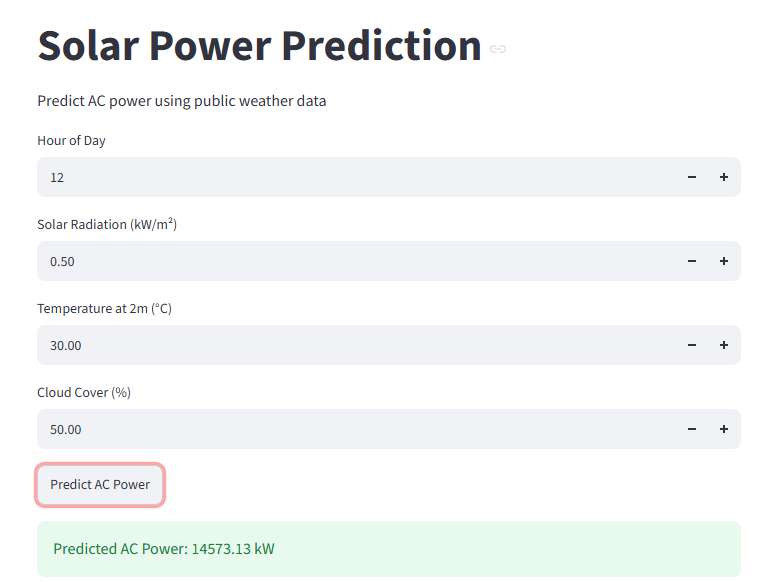

## Group Members

| Name | Roll Number |

| Shoaib Mansoor Shah Nawaz | 23F6-03-7 |
| Muhammad Malik | 22F3-4-8-7 |
# AI4003 Applied Machine Learning Assignment

## Predicting Solar Power Plant Output from Weather

This project predicts solar power plant AC output using weather and plant sensor data.

Three linear regression approaches were implemented manually:

1. Normal Equation
2. Batch Gradient Descent
3. Stochastic Gradient Descent

Only NumPy, Pandas, Matplotlib, Requests, and Streamlit were used.

## Dataset

The project uses Plant 1 solar generation and weather sensor data.

The main measurements are:

- AC Power
- DC Power
- Irradiation
- Ambient Temperature
- Module Temperature

Public historical weather data was obtained from Open-Meteo.

## Weather Feature Sets

### Set A - On-site Sensors

Set A uses:

- Irradiation
- Module Temperature
- Ambient Temperature
- Sin(hour)
- Cos(hour)

### Set B - Open-Meteo

Set B uses:

- Shortwave Radiation
- Temperature at 2 m
- Cloud Cover
- Sin(hour)
- Cos(hour)

The numerical features were standardized using training-set statistics only.

## Train/Test Split

Training period:

15 May 2020 to 10 June 2020

Testing period:

11 June 2020 to 17 June 2020

After removing required missing values:

- Training rows: 628
- Testing rows: 168

The test set was not used for model fitting or learning-rate selection.

## Regression Methods

### Normal Equation

The parameters were calculated using:

theta = (X^T X)^(-1) X^T y

### Batch Gradient Descent

Selected learning rate:

alpha = 0.001

### Stochastic Gradient Descent

Selected learning rates:

- Set A: alpha = 0.01
- Set B: alpha = 0.001

## Results

| Weather Set | Method | Test RMSE (kW) |
|---|---|---:|
| Set A | Normal Equation | 553.319 |
| Set A | Batch GD | 580.618 |
| Set A | SGD | 569.245 |
| Set B | Normal Equation | 2626.129 |
| Set B | Batch GD | 2626.129 |
| Set B | SGD | 2588.633 |

Set A gives substantially lower prediction error than Set B.

## Model Convergence

For Set A, Batch Gradient Descent was run for 5000 iterations with alpha = 0.001.

The maximum difference between the Normal Equation and Batch GD parameters was:

0.000143

Therefore, the two methods agree to at least two decimal places.

## Project Structure

AI4003-AML-Assignment/

    data/
        Plant_1_Generation_Data.csv
        Plant_1_Weather_Sensor_Data.csv
        Plant_2_Generation_Data.csv
        Plant_2_Weather_Sensor_Data.csv
        plant1_hourly.csv
        plant1_openmeteo.csv

    src/
        load_data.py
        prepare.py
        eda.py
        fetch_weather.py
        regression.py
        train_eval.py

    results/
        table1_data_preparation.csv
        table2_rmse.csv
        table3_theta.csv
        analysis.md
        setB_model.npz
        figures/

    app/
        app.py

    README.md

## Running the Project

Install the required libraries:

pip install numpy pandas matplotlib requests streamlit

Run the Streamlit application:

streamlit run app/app.py

The application accepts:

- Hour of day
- Solar radiation
- Temperature at 2 m
- Cloud cover

and returns predicted AC power.

## Results and Figures

The results directory contains:

- Data preparation table
- RMSE comparison table
- Learned parameter table
- Analysis and discussion
- Saved Set B model
- Required figures

## Conclusion

The results show that on-site sensor measurements provide more accurate solar power predictions than the public Open-Meteo weather variables for this dataset.

The Normal Equation performs well for the relatively small training dataset. Batch Gradient Descent reaches essentially the same parameter solution after sufficient iterations, while SGD provides an alternative approach for larger datasets.

## Front-End Screenshot

The Streamlit front end allows the user to enter the hour, solar radiation, temperature, and cloud cover and returns the predicted AC power.

